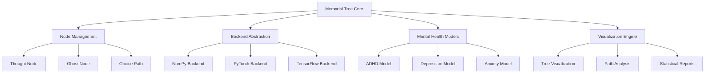

# Design Document

## Overview

메모리얼 트리(Memorial Tree)는 인간의 사고 과정을 모델링하기 위한 혁신적인 자료구조입니다. 이 시스템은 의식적인 의사결정과 무의식적인 영향을 모두 포함하여 복잡한 인간 사고를 표현하며, 계산 정신의학 연구를 위한 도구로 활용됩니다.

핵심 개념:
- **사고 노드(Thought Node)**: 각 사고나 선택지를 나타내는 기본 단위
- **고스트 노드(Ghost Node)**: 무의식적 영향이나 억압된 기억을 표현
- **선택 경로(Choice Path)**: 의사결정 과정에서 선택된 경로
- **영향 가중치(Influence Weight)**: 각 노드가 의사결정에 미치는 영향력

## Architecture

### 시스템 아키텍처



### 레이어 구조

1. **Core Layer**: 기본 트리 자료구조와 노드 관리
2. **Backend Layer**: 다양한 수치 계산 프레임워크 지원
3. **Model Layer**: 정신질환별 특화 모델
4. **Interface Layer**: 사용자 API와 시각화 도구

## Components and Interfaces

### 1. Core Components

#### MemorialTree 클래스
```python
class MemorialTree:
    def __init__(self, backend='numpy'):
        self.root = None
        self.backend = backend
        self.ghost_nodes = []
        self.current_path = []

    def add_thought(self, parent_id, content, weight=1.0)
    def add_ghost_node(self, content, influence=0.3)
    def make_choice(self, node_id)
    def get_current_state(self)
    def visualize(self)
```

#### ThoughtNode 클래스
```python
class ThoughtNode:
    def __init__(self, content, node_id, weight=1.0):
        self.content = content
        self.node_id = node_id
        self.weight = weight
        self.children = []
        self.parent = None
        self.activation_count = 0
        self.timestamp = None

    def add_child(self, child_node)
    def calculate_influence(self)
    def get_path_to_root(self)
```

#### GhostNode 클래스
```python
class GhostNode(ThoughtNode):
    def __init__(self, content, influence=0.3, visibility=0.1):
        super().__init__(content, generate_id())
        self.influence = influence  # 0-1 사이의 영향력
        self.visibility = visibility  # 의식적 인지 가능성
        self.trigger_conditions = []

    def check_activation(self, current_context)
    def apply_influence(self, decision_weights)
```

### 2. Backend Abstraction

#### BackendManager 클래스
```python
class BackendManager:
    def __init__(self, backend_type):
        self.backend_type = backend_type
        self.backend = self._initialize_backend()

    def _initialize_backend(self):
        if self.backend_type == 'numpy':
            return NumpyBackend()
        elif self.backend_type == 'pytorch':
            return PyTorchBackend()
        elif self.backend_type == 'tensorflow':
            return TensorFlowBackend()

    def create_tensor(self, data)
    def calculate_weights(self, nodes)
    def apply_softmax(self, logits)
```

### 3. Mental Health Models

#### ADHDModel 클래스
```python
class ADHDModel:
    def __init__(self):
        self.attention_span = 0.3  # 낮은 주의 지속시간
        self.impulsivity = 0.8     # 높은 충동성
        self.distraction_rate = 0.6 # 주의 분산 확률

    def modify_decision_process(self, tree, current_node):
        # 주의력 분산 시뮬레이션
        # 충동적 선택 확률 증가
        # 장기적 계획 능력 감소
```

#### DepressionModel 클래스
```python
class DepressionModel:
    def __init__(self):
        self.negative_bias = 0.7    # 부정적 사고 편향
        self.decision_delay = 2.0   # 의사결정 지연
        self.energy_level = 0.3     # 낮은 에너지 수준

    def modify_decision_process(self, tree, current_node):
        # 부정적 선택지에 가중치 부여
        # 의사결정 속도 감소
        # 회피 행동 패턴 구현
```

#### AnxietyModel 클래스
```python
class AnxietyModel:
    def __init__(self):
        self.worry_amplification = 0.8  # 걱정 증폭
        self.risk_aversion = 0.9        # 위험 회피 성향
        self.rumination_cycles = 3      # 반복 사고 횟수

    def modify_decision_process(self, tree, current_node):
        # 위험 요소 과대평가
        # 안전한 선택지 선호
        # 반복적 사고 패턴 구현
```

## Data Models

### 노드 데이터 구조
```python
NodeData = {
    'id': str,
    'content': str,
    'weight': float,
    'parent_id': Optional[str],
    'children_ids': List[str],
    'node_type': Literal['thought', 'ghost'],
    'metadata': Dict[str, Any],
    'timestamp': datetime,
    'activation_history': List[datetime]
}
```

### 트리 상태 구조
```python
TreeState = {
    'current_node_id': str,
    'path_history': List[str],
    'active_ghost_nodes': List[str],
    'decision_weights': Dict[str, float],
    'backend_tensors': Dict[str, Any],
    'model_parameters': Dict[str, float]
}
```

### 시각화 데이터 구조
```python
VisualizationData = {
    'nodes': List[NodeData],
    'edges': List[Tuple[str, str, float]],
    'ghost_influences': Dict[str, float],
    'path_highlights': List[str],
    'layout_coordinates': Dict[str, Tuple[float, float]]
}
```

## Error Handling

### 예외 클래스 계층구조
```python
class MemorialTreeError(Exception):
    """기본 예외 클래스"""
    pass

class NodeNotFoundError(MemorialTreeError):
    """노드를 찾을 수 없을 때"""
    pass

class InvalidBackendError(MemorialTreeError):
    """지원하지 않는 백엔드일 때"""
    pass

class CircularReferenceError(MemorialTreeError):
    """순환 참조가 발생할 때"""
    pass

class InsufficientDataError(MemorialTreeError):
    """데이터가 부족할 때"""
    pass
```

### 에러 처리 전략
1. **Graceful Degradation**: 일부 기능 실패 시 기본 기능은 유지
2. **Logging**: 모든 에러와 경고를 상세히 기록
3. **Recovery**: 가능한 경우 자동 복구 시도
4. **User Feedback**: 명확한 에러 메시지와 해결 방안 제공

## Testing Strategy

### 1. 단위 테스트 (Unit Tests)
- **노드 생성/삭제**: 각 노드 타입의 기본 동작 검증
- **트리 구조**: 부모-자식 관계, 경로 탐색 기능
- **백엔드 호환성**: 각 백엔드별 텐서 변환 정확성
- **정신질환 모델**: 각 모델의 파라미터 적용 결과

### 2. 통합 테스트 (Integration Tests)
- **전체 워크플로우**: 트리 생성부터 시각화까지
- **백엔드 전환**: 런타임 중 백엔드 변경 시나리오
- **모델 조합**: 여러 정신질환 모델 동시 적용
- **대용량 데이터**: 큰 트리에서의 성능 검증

### 3. 성능 테스트 (Performance Tests)
- **메모리 사용량**: 노드 수 증가에 따른 메모리 효율성
- **계산 속도**: 의사결정 과정의 실행 시간
- **확장성**: 동시 다중 트리 처리 능력
- **백엔드 성능**: 각 백엔드별 연산 속도 비교

### 4. 사용성 테스트 (Usability Tests)
- **API 직관성**: 개발자 친화적 인터페이스
- **문서화**: 예제 코드의 실행 가능성
- **에러 메시지**: 문제 해결에 도움이 되는 정보 제공
- **시각화**: 결과의 이해하기 쉬운 표현

### 5. 도메인 특화 테스트 (Domain-Specific Tests)
- **심리학적 타당성**: 실제 인간 사고 패턴과의 일치도
- **임상 데이터 검증**: 실제 환자 데이터와의 비교
- **연구 재현성**: 동일한 조건에서 일관된 결과 생성
- **윤리적 고려사항**: 민감한 정신건강 데이터 처리

### 테스트 자동화
- **CI/CD 파이프라인**: GitHub Actions를 통한 자동 테스트
- **코드 커버리지**: 최소 90% 이상 유지
- **성능 벤치마크**: 각 릴리스별 성능 회귀 검사
- **호환성 매트릭스**: 다양한 Python 버전과 의존성 조합 테스트